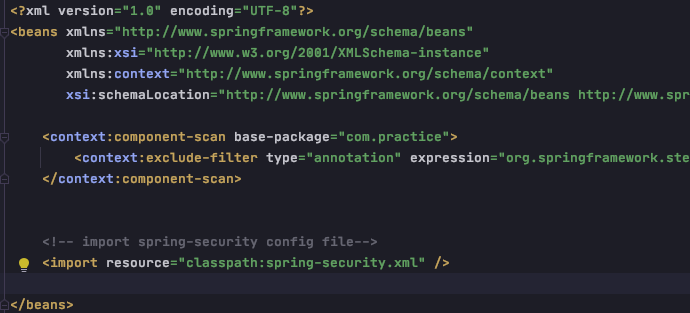

# Spring Security

1. 本质
    
        - authentication(认证) + authorization(授权)
        - 一个过滤器链 

2. 认证 + 授权的实现方式

        - springMVC + javax.servlet: 
            login认证(存session), interceptor授权
        - spring security

3. Spring Security 中常用的15个过滤器 (AOP) - 封装在SecurityFilterChain (i), 实现于DefaultSecurityFilterChian (c)
        
        - 1.org.springframework.security.web.context.SecurityContextPersistenceFilter
        使用SecurityContextRepository在session中保存或更新一个SecurityContext,(spring security 容器初始化)，并将SecurityContext给以后的过滤器使用，为后续filter提供所需的上下文
        
        - 2.org.springframework.security.web.context.request.async.WebAsyncManagerIntegrationFilter
        用于继承SecurityContext到Spring异步执行机制中的WebAsyncManager (与spring,web容器整合)
        
        - 3.org.springframework.security.web.header.HeaderWriterFilter
        向请求的Header中添加相应的信息，可在http标签内部使用security:headers来控制
        
        - 4.org.springframework.security.web.csrf.CsrfFilter
        csrf为跨域伪造请求，SpringSecurity会对所有post请求验证是否包含系统生成的csrf的token信息，如果不包含，
        则报错，起到防止csrf攻击的效果
        
        - 5.org.springframework.security.web.authentication.logout.LogoutFilter
        匹配URL为/logout的请求，实现用户退出，清除认证信息
        
        - 6.org.springframework.security.web.authentication.UsernamePasswordAuthenticationFilter
        认证操作全靠这个过滤器，默认匹配URL为/login且必须为POST操作
        
        - 7.org.springframework.security.web.authentication.ui.DefaultLoginPageGeneratingFilter
        如果没有在配置文件中指定认证页面，则由该过滤器生成一个默认认证页面
        
        - 8.org.springframework.security.web.authentication.ui.DefaultLogoutPageGeneratingFilter
        由此过滤器可以生产一个默认的退出登录页面
        
        - 9.org.springframework.security.web.authentication.www.BasicAuthenticationFilter
        此过滤器会自动解析HTTP请求中头部名字为Authentication, 且以Basic开头的信息
        
        - 10.org.springframework.security.web.savedrequest.RequestCacheAwareFilter
        通过HttpSessionRequestCache内部维护一个RequestCache, 用于缓存HttpServletRequest
        
        - 11.org.springframework.security.web.servletapi.SecurityContextHolderAwareRequestFilter
        针对ServletRequest进行了一次包装，使得request具有更加丰富的API
        
        - 12.org.springframework.security.web.authentication.AnonymousAuthenticationFilter
        当SecurityContextHolder中认证信息为空，则会创建一个匿名用户存入到SecurityContextHolder中，spring security
        为了兼容未登录的访问，也走了一套认证流程，只不过是一个匿名的身份
        
        - 13.org.springframework.security.web.session.SessionManagementFilter
        SecurityContextRepository限制同一用户开启多个会话的数量
        
        - 14.org.springframework.security.web.access.ExceptionTranslationFilter
        异常转换过滤器位于整个springSecurityFilterChain的后方，用来转换整个链路中出现的异常
        
        - 15.org.springframework.security.web.access.intercept.FilterSecurityInterceptor
        获取所配置资源访问的授权信息，根据SecurityContextHolder中存储的用户信息来决定其是否有权限
        
        
4. 开发过程

    a. 引入Spring Security依赖

        - spring-security-core (核心功能包)
        - spring-security-web (web工程必备，包含过滤器和web安全基础结构代码)
        - spring-security-config (动态地生成spring-security配置文件)
        - spring-security-taglibs (动态标签库，jsp页面可用)
        
        
    b. web.xml 中配置 filter

    
    
    c. 在applicationContext.xml中引入spring-security.xml
    

    d. 创建spring-security.xml 核心配置文件

            
         0) 放行匿名访问资源 
            - 放行后不再经过其他过滤器

            - 放行后仍需经过其他过滤器

        1） 如果使用自定义的login页

    
    
        2） 如果不适用内存认证，而使用jdbc认证: jdbc authenticate & BCrypt password encoding: 
        
            step0: spring-security.xml中配置

            step1: UserService接口继承 UserDetailsService

            step2: UserServiceImpl 实现UserService的方法，在loadUserByUsername中，通过username查找数据库
        将返回的对象进行封装(包括用户名，密码，状态等)成UserDetails 对象，供SpringSecurity的/login处理器进行认证

